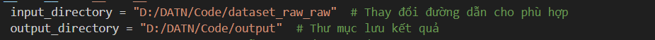

# Hướng dẫn Cài đặt

## Bước 1: Cài đặt thư viện

- cài theo fiel requirements.txt
- cài xong thì mở cmd chạy 'svcg' nếu hiện ra giao diện  là thành công

## Bước 2: Tải dataset

- vào link : https://drive.google.com/drive/folders/1rb2syP4U7jYz_z9WoG7MVR6t3i375smZ?usp=sharing
- tải folder dataset về đổi tên thành dataset_raw

## Bước 3

- Tìm kiếm folder thư viện so-vits-svc-fork mà mình cài ở máy ảo
- cho folder dataset_raw vào trong đó như hình 
- mở cmd tại đó luôn
- chạy lần lượt 4 lệnh
  - svc pre-resample
  - svc pre-config
  - svc pre-hubert
  - svc train -t

# Hướng dẫn cắt audio

-  sửa 2 cái này. audio cần cắt cứ nhét hết vào file dataset_raw_raw.
- Folder output thì trong dataset_raw hãy tạo 1 folder trên ca sĩ rồi cho output đã split vô đó
