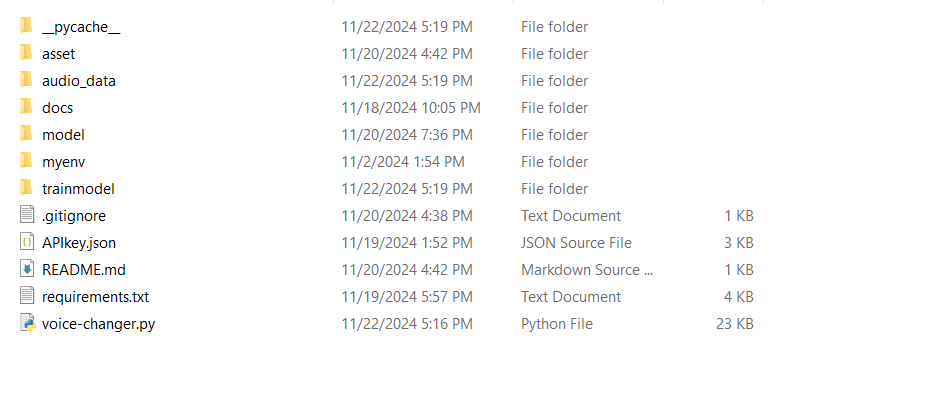

# Hướng dẫn Cài đặt

- Sử dụng python 3.10.15

## Bước 1: Tạo môi trường ảo

- Cho Ubuntu và kích hoạt

```bash
python3.10 -m venv venv
source venv/bin/activate
```

- Cho Window

```bash
py -3.10 -m venv venv
venv\Scripts\activate
```

## Bước 2: Cài đặt thư viện

- cài thư viện pytorch và so-vits-svc

```bash
pip install -U torch torchaudio --index-url https://download.pytorch.org/whl/cu121
pip install -U so-vits-svc-fork
```

- cài theo file requirements.txt

```bash
pip install -r requirements.txt
```
- Để các file trong 1 folder như hình 
